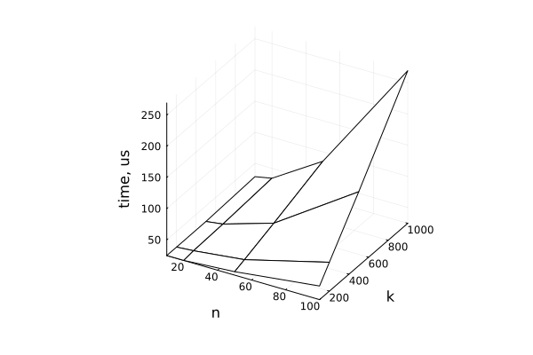
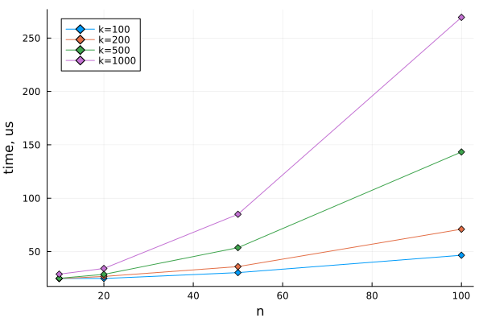
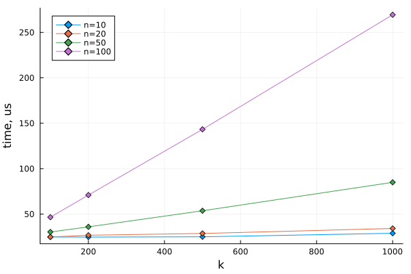

The solution is contained in a single Jupyter notebook. I wanted to do the task using Julia and CUDA, however, I do not own a machine with an Nvidia GPU card. For this reason and also for reproducibility, I used Google Colab with _Runtime type: Julia_ and _Hardware accelearator: T4 GPU_.

The notebook contains implementation of several different approaches with explanations and basic benchmarking and visualization.

Both CUDA and Julia are new to me. I used [this](https://g.co/kgs/trm6WZe) textbook and the official Julia and CUDA.jl documentation as primary resources.

Results (k=1000, n=50):\
cpu: 1712 us\
gpu: 155 us\
gpu (exploit sym on host): 85 us\
gpu (exploit sym on device): 332 us

Plots:\
\
\

